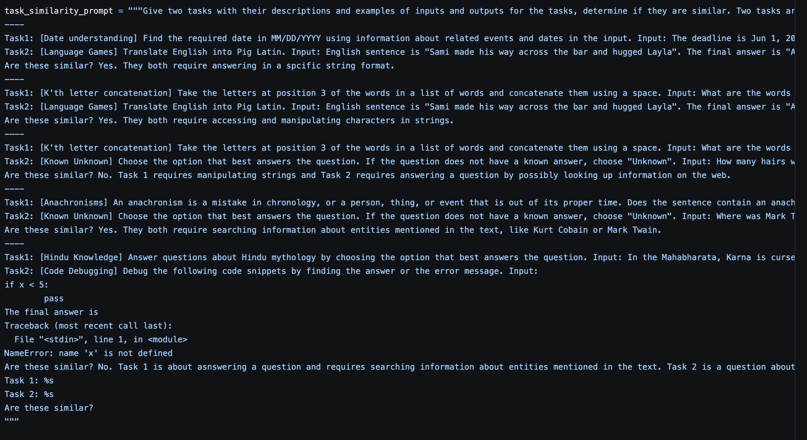
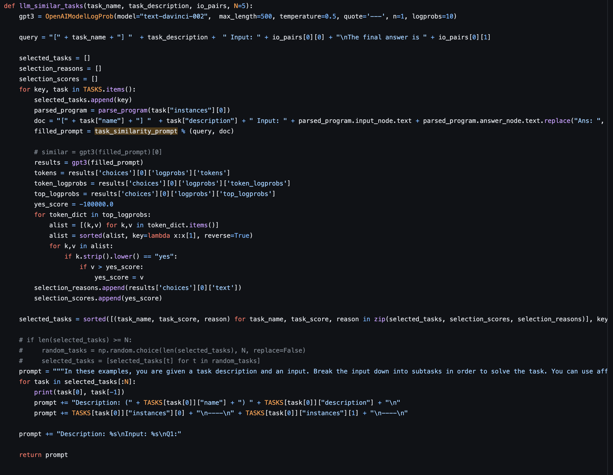
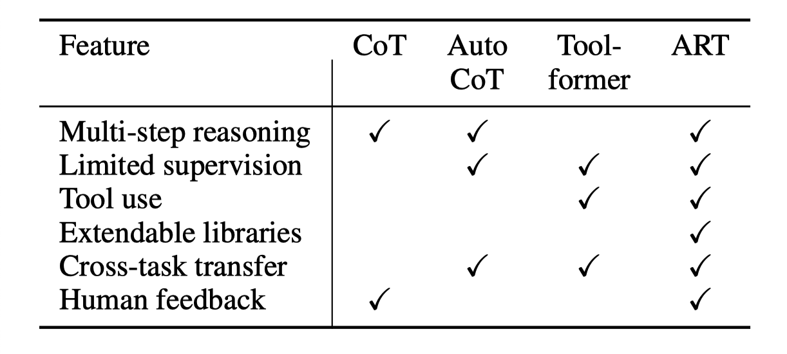
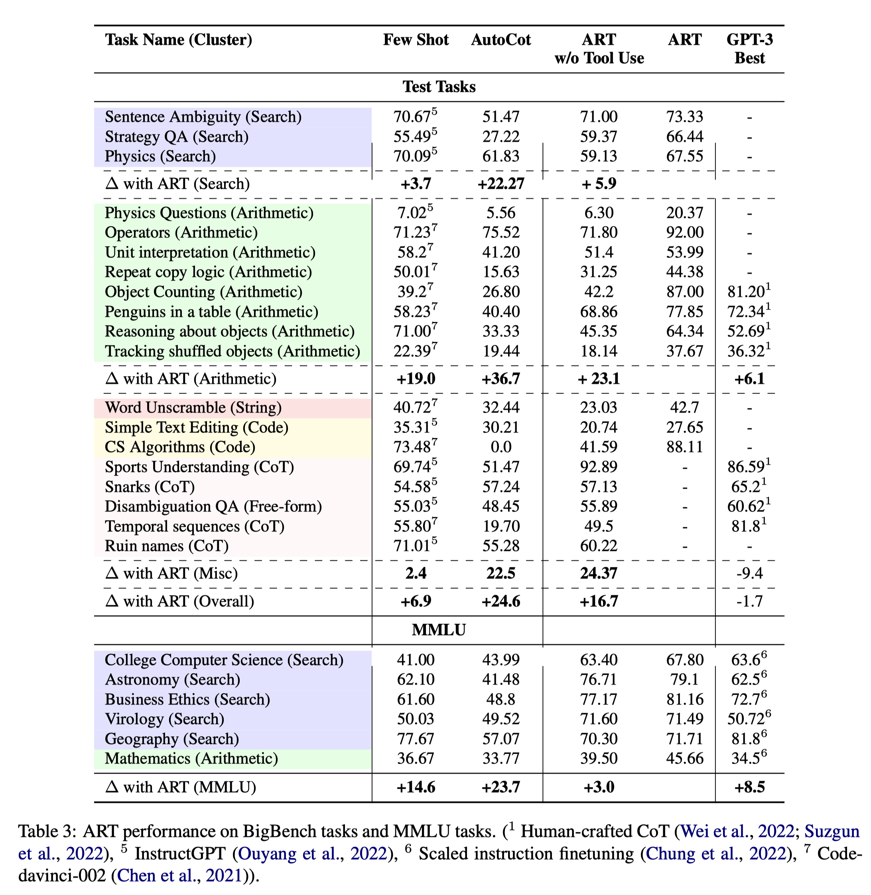

# LLM Tool using Collections

> by WangYC @ Zhipu.AI

[toc]

## Toolformer

https://arxiv.org/abs/2302.04761

Meta AI

Feb 2023

### Tools

格式统一为<tool名称(输入)>的格式

| Area                | Tool                                      |
| ------------------- | ----------------------------------------- |
| QA                  | Atlas Model                               |
| Calculator          | 自己写的加减乘除法函数 精确到小数点后两位 |
| Web Search          | BM25 retriever                            |
| Machine Translation | NLLB Model                                |
| Calendar            | calendar API                              |

### contrubutions

没明确写 自己总结：

* 第一篇tool using的paper
* zero-shot的模型推理能力（相较于后来的）

### methods

bootstrapping 的过程中采用了特殊的loss定义来保证api的调用位置以及调用格式是符合要求的

同时在bootstrapping的过程中采用了heuristics的方法保证数据集的利用效率

finetune过程是语言建模任务finetune的GPT-J

### evaluation

数据集是CCNet的subset

#### baselines：

#### downstream tasks

| Area              | Task               |
| ----------------- | ------------------ |
| General           | LAMA subset        |
| Math              | AsSDiv SVAMP MAWPS |
| QA                | WebQS NQ TriviaQA  |
| MultiLingual QA   | MLQA               |
| Temporal Dataset  | TEMPLAMA           |
| Language Modeling | WikiText CCNet     |

### weakness

evaluation的过程是分别打的不同area的榜，比如QA的榜、math的榜分开，而没有打一个综合的榜，不涉及不同Area的api的嵌套使用

## ART

### Tools

| Area            | Tool                       |
| --------------- | -------------------------- |
| Search          | SerpAPI(Google Search)     |
| Code generation | Codex                      |
| Code Exicution  | virtual Python environment |

### contributions

### methods

#### 筛选tool的思路

https://github.com/google/BIG-bench/blob/main/bigbench/benchmark_tasks/keywords_to_tasks.md#summary-table

从bigbench中提炼出的最常用skills：

Visual Reasoning, Temporal Reasoning, Propositional logic, Natural Logic, Machine Translation, Web Search, Knowledge Base or Database lookup, Recursive sub-question decomposition, Long text understanding, Database Operations, Algebra and Arithmetic, Code Generation and Editing, Text Tagging/Annotation(linguistic markers), Specialized Search(eg. looking up linguistic knowledge, scientific knowledge etc), String editing, Recursive operations over multiple choices, Topic classification, Evidence extraction, conditional Text Generation/Editing, and Sentence similarity.

随后选取了most used的5个task：

#### task choosing的过程

https://github.com/bhargaviparanjape/language-programmes/blob/master/src/affordance/tasks/prompt_library.py

### evaluation

Input-Output Instances of Big bench:

mainly text classification and short answer generation tasks in English

#### baselines

#### downstream tasks

### weakness

执行是用python code执行的，并不是LLM执行。

通用目标。

## Party

https://github.com/UT-MPC/homegpt

### Tools

硬件灯

### contributions

sementic parsing统一为json格式

高级抽象化的natural language的query parsing

### methods

prmopt engineering

### evaluation

#### baselines

#### downstream tasks

### weakness

没有采用LM执行

家具的数量有限，状态易于表示，相当于是一个状态机

## Matrix.AI

### 

## HuggingGPT

